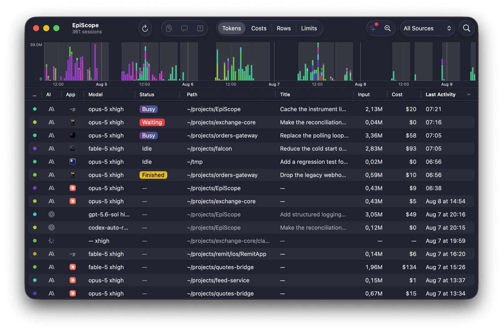
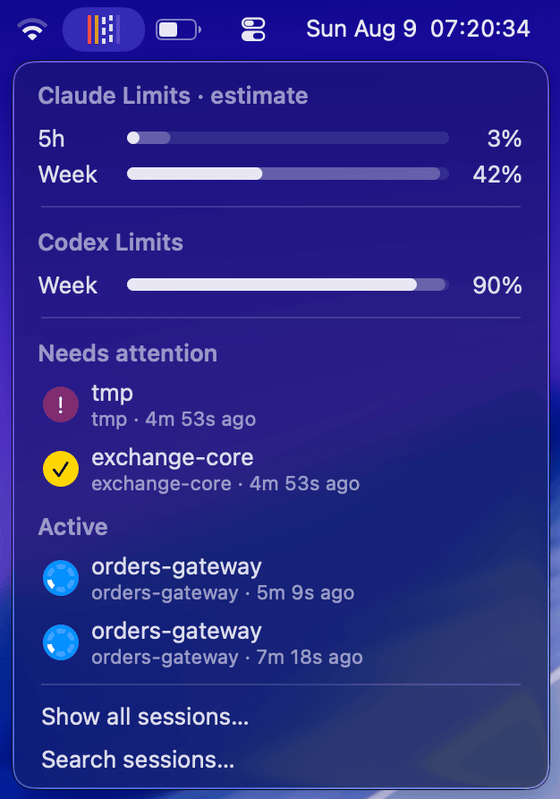

<p align="center">
  
</p>

<h1 align="center">EpiScope</h1>

<p align="center">
  <strong>The native macOS control center for your AI coding sessions.</strong><br>
  Monitor every session, search every conversation, and understand where your
  tokens, time, and money go.
</p>

<p align="center">
  <kbd>Claude Code &amp; Desktop</kbd>&nbsp;&nbsp;
  <kbd>OpenAI Codex</kbd>
</p>

<p align="center">
  <strong>Free and open source</strong> · Local-first · No telemetry<br>
  No EpiScope account · No subscription
</p>

<p align="center">
  <code>brew install --cask AlmazKo/tap/episcope</code>
</p>



---

## One workspace for every agent session

Running several coding agents in parallel is most useful when you can see what
each one is doing and return as soon as it needs you. EpiScope brings terminal
tabs, desktop threads, projects, and session history into one clear view.

It watches each session's live state, brings you back when attention is needed,
indexes your history, and turns agent activity into useful statistics and
AI-assisted insights.

It is more than a session switcher: **EpiScope is search and analytics for your
entire local agent history.**

## What EpiScope brings together

<table>
  <tr>
    <td width="50%" valign="top">
      <h3>Manage the whole fleet</h3>
      See live and historical sessions from Claude Code, Codex, and Claude
      Desktop in one table. Track status, model, project, tokens, cost, turns,
      code changes, and last activity.
    </td>
    <td width="50%" valign="top">
      <h3>React at the right moment</h3>
      The menu bar shows which sessions are working, finished, failed, or
      waiting for permission. Optional sounds and macOS notifications bring you
      back while you stay focused on your current work.
    </td>
  </tr>
  <tr>
    <td width="50%" valign="top">
      <h3>Search every conversation</h3>
      Full-text search runs across the complete local history of every supported
      agent. Open a result directly at the matching message.
    </td>
    <td width="50%" valign="top">
      <h3>Understand your usage</h3>
      Explore token and cost timelines by session and project, monitor account
      limits, and understand how your agent budget is distributed.
    </td>
  </tr>
  <tr>
    <td width="50%" valign="top">
      <h3>Get daily and weekly insights</h3>
      Automatic reports surface anomalies, expensive patterns, project health,
      recurring friction, and concrete candidates for improving
      <code>CLAUDE.md</code>.
    </td>
    <td width="50%" valign="top">
      <h3>Jump to the exact session</h3>
      Open the exact terminal tab or desktop thread that owns a live session.
    </td>
  </tr>
</table>

## 🔔 Know when any session needs you

The menu-bar indicator is a compact live view of the entire fleet. It animates
while agents work, turns red for a permission request, and turns amber when a
turn finishes or fails. Open it to see every active session and every session
that needs attention, alongside your Claude and Codex rate-limit meters.

<p align="center">
  
</p>

Click a session or its notification to return to it immediately. EpiScope can
focus the exact tab in kitty, iTerm2, Terminal.app, Ghostty, and Agterm, or open
the exact thread in Claude Desktop and the Codex app.

## 🔎 Search is a first-class feature

Session history is most useful when it is easy to retrieve. Press
<kbd>⌘ F</kbd> to search the full text of every indexed conversation across
providers and projects. Results appear as message-level excerpts; selecting one
opens the conversation at that exact message.

The search index is built incrementally with the system SQLite FTS5 library and
stays on your Mac.

## ✨ Analytics across every session

EpiScope keeps a long-term record of sessions, tokens, cost, turns, code changes,
permission wait time, and tool activity. Use the timeline and table to compare
projects, models, providers, and individual sessions through one consistent
view.

Optional **AI Insights** turn those statistics into one focused daily report and
one weekly review:

- what needs attention
- cost, usage, and potential savings
- anomalies and recurring hotspots
- health summaries for each project
- evidence-backed suggestions for your agent instructions

The metrics are computed locally from the index. Narrative analysis is generated
through the CLI and model you configure — `claude` or `codex`. See
[`docs/insights-lab.md`](docs/insights-lab.md) for the methodology.

## ⚡ Native, lightweight, and local-first

EpiScope is a pure AppKit application with no third-party runtime dependencies.
The universal binary is about **3 MB** and uses about **30 MB of memory** when
idle. It is designed to stay open all day alongside your agents.

## 🔐 Privacy and analytics

> [!IMPORTANT]
> **EpiScope does not collect product analytics.** There is no telemetry,
> analytics SDK, tracking, EpiScope account, or remote dashboard. The app does
> not report which features you use, which projects you work on, or what your
> sessions contain.

The statistics shown inside EpiScope are computed for you on your Mac. Session
history is read from the agents' local files; the full-text index, usage
metrics, costs, and reports are stored locally and are never collected by the
project author.

> [!NOTE]
> Optional **AI Insights** explicitly invoke your local `claude` or `codex` CLI,
> whichever the chosen model belongs to. Those
> requests follow the network, account, and data-handling configuration of that
> CLI and the provider behind it. The EpiScope project does not receive or
> collect the requests or results.

## 🛡️ Security by design

- **Small attack surface.** The app has no networking code, embedded web
  service, third-party runtime dependencies, account system, or Keychain
  access.
- **Defensive input handling.** Session IDs are validated before file access,
  external values are passed to AppleScript as arguments, and generated links
  are limited to web URLs.
- **Conservative file access.** EpiScope reads session data from `~/.claude`
  and `~/.codex`. Its Claude Code integration is installed additively, keeps a
  backup of modified configuration, and never clobbers an existing status line.
  Files owned by EpiScope are updated atomically.
- **Private temporary data.** Analysis scratch data uses the private per-user
  temporary directory and is removed after a successful run.
- **Verified distribution.** Release builds and DMGs are developer-signed,
  Apple-notarized, and stapled.

The complete read/write boundary is documented in
[`docs/file-io.md`](docs/file-io.md).

---

## 🧩 Supported apps and terminals

EpiScope currently supports sessions from
[**Claude Code**](https://claude.com/claude-code),
[**OpenAI Codex**](https://github.com/openai/codex), and **Claude Desktop**,
including Code and Cowork sessions.

> **Exact window and tab**<br>
> kitty · iTerm2 · Terminal.app · Ghostty 1.3+ · [Agterm](docs/agterm.md)

> **Exact desktop session**<br>
> Claude Desktop · Codex app

> **Detected with a universal fallback**<br>
> Other terminals and IDEs open at the session directory.

Every live row carries its host application's icon, making parallel sessions
easy to distinguish at a glance.

## 📦 Install

Install with Homebrew:

```bash
brew install --cask AlmazKo/tap/episcope
```

Or download the latest DMG from
[GitHub Releases](https://github.com/AlmazKo/EpiScope/releases) and drag EpiScope
to `/Applications`. The app and DMG are signed, notarized, and stapled, so the
first launch works offline.

### Requirements

macOS 14 Sonoma or newer. Apple Silicon and Intel Macs are supported.

<details>
<summary><strong>Build from source</strong></summary>

<br>

```bash
git clone https://github.com/AlmazKo/EpiScope.git
cd EpiScope
open EpiScope.xcodeproj
```

Choose your own development team in Xcode under *Signing & Capabilities*, then
press **⌘R**. You can also build without signing by setting
`CODE_SIGNING_ALLOWED=NO`.

</details>

---

## 💜 Free and open source

EpiScope is free to use, has no paid tier, and is released under the
[MIT License](LICENSE). Issues, ideas, and contributions are welcome.
